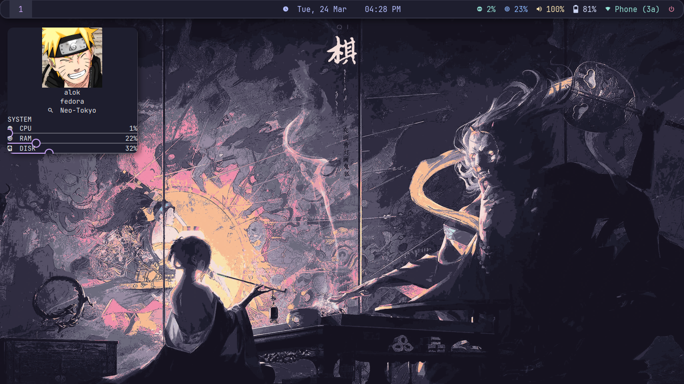

# Fedora i3 Dotfiles

My personal Fedora Linux rice built around i3wm with a clean Catppuccin Mocha aesthetic.

## Preview



---

# Environment

- OS: Fedora Linux
- WM: i3wm
- Bar: Polybar
- Terminal: Alacritty
- Shell: Zsh + Oh My Zsh + Powerlevel10k
- Compositor: Picom
- Launcher: Rofi
- Notifications: Dunst
- Widgets: Eww
- Theme: Catppuccin Mocha
- Icons: Papirus-Dark
- Wallpaper Manager: Feh

---

# Included Configurations

This repository contains configuration files for:

- i3
- Polybar
- Rofi
- Picom
- Dunst
- Eww
- Alacritty
- Zsh
- Wallpapers
- Custom scripts

---

# Directory Structure

```bash
.
├── alacritty
├── dunst
├── eww
├── i3
├── picom
├── polybar
├── rofi
├── scripts
├── screenshots
├── wallpapers
├── zsh
├── install.sh
├── README.md
├── .gitignore
└── .gitattributes
```

---

# Installation

## Clone the repository

```bash
git clone https://github.com/thealokverse/dotfiles.git
cd dotfiles
```

## Run installation script

```bash
chmod +x install.sh
./install.sh
```

---

# Required Packages

Install these packages before applying the configuration:

## Core

```bash
i3
polybar
rofi
picom
dunst
feh
eww
alacritty
zsh
git
```

## Fonts

Recommended fonts:

- JetBrains Mono Nerd Font
- MesloLGS NF

---

# Theme

- GTK Theme: Catppuccin Mocha
- Icon Theme: Papirus-Dark
- Terminal Theme: Catppuccin Mocha

---

# Wallpapers

Wallpapers used in this setup are included in:

```bash
wallpapers/
```

---

# Screenshots

Add screenshots to:

```bash
screenshots/
```

Example:

- desktop.png
- rofi.png
- terminal.png

---

# Notes

Some paths and scripts may require minor adjustments depending on your system setup.

This setup was created and tested on Fedora Linux.

---

# License

MIT License
